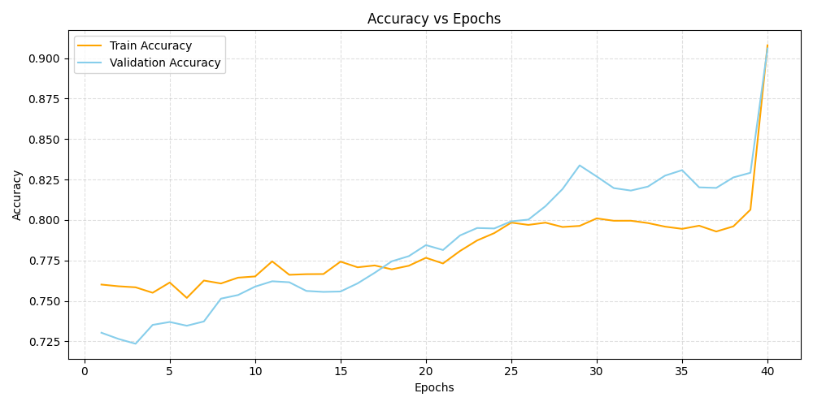
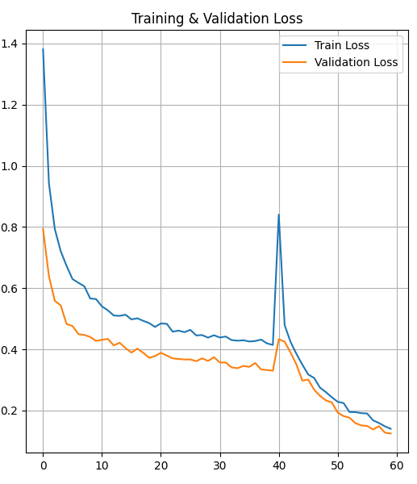
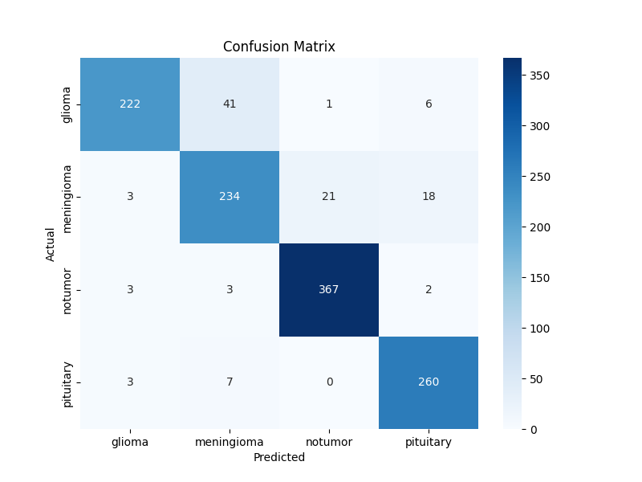
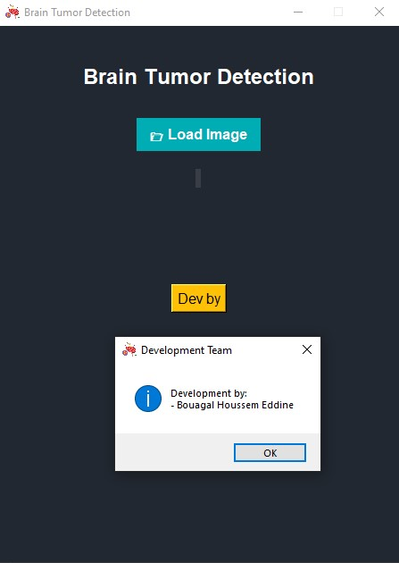
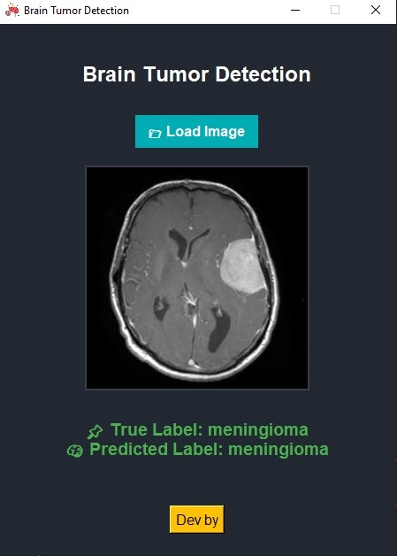
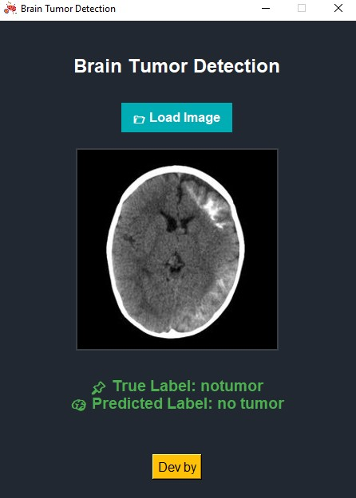
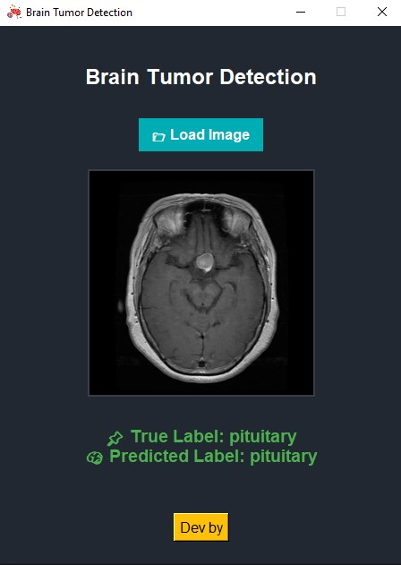

# 🧠 Brain Tumor Detection System (Desktop AI Assistant)

A professional desktop application that uses deep learning techniques to classify brain MRI images and detect tumors with high accuracy. Built using TensorFlow and wrapped with a Tkinter interface, this AI tool offers a fast, lightweight, and offline solution for medical research support.


> 📖 **License**: This project is licensed under the [MIT License](#-license).

---

## 💡 Overview

The system automatically analyzes brain MRI scans and classifies them into four categories:

- **Glioma Tumor**
- **Meningioma Tumor**
- **Pituitary Tumor**
- **No Tumor**

It is designed to assist medical professionals and researchers by providing quick predictions and a user-friendly offline tool.

---

## 🎯 Model Summary

| Metric              | Value (%)   |
|---------------------|-------------|
| **Training Accuracy** | 94.72       |
| **Testing Accuracy**  | 93.87       |
| **Model Used**        | MobileNetV2 |
| **Training Epochs**   | 40 epochs + 20 fine-tuning |

The model demonstrates excellent generalization and strong performance on unseen test data.

---

## 📈 Accuracy & Loss Curves

  


These graphs represent the model's training and validation accuracy/loss over time.

---

## 📊 Confusion Matrix



The confusion matrix indicates the model's classification ability across the four categories.

---

## 🖥️ Application UI



## 🧪 Test Examples

 Glioma


Meningioma



No Tumor



Pituitary


### Features:
- 📂 Drag & drop or browse to load MRI images.
- 🤖 AI-powered prediction using a trained CNN model.
- ✅ Class comparison with the true label.
- 🧼 Clean, minimalistic, and modern Tkinter GUI.

---

## ▶️ How to Run

### 1. Clone the repository:

```bash
git clone https://github.com/HoussemBouagal/Brain-Tumor-Detection.git
cd Brain-Tumor-Detection
```

### 2. Install required dependencies:

```bash
pip install -r requirements.txt
```

### 3. Launch the app:

```bash
python main.py
```

---

## 🧪 Tech Stack

- **Programming Language**: Python 3.x  
- **Deep Learning Framework**: TensorFlow & Keras  
- **Model Architecture**: MobileNetV2  
- **Image Input Size**: 224x224 RGB  
- **GUI**: Tkinter  
- **Image Handling**: PIL, NumPy  

---

## 📦 Requirements (requirements.txt)

```txt
tensorflow
numpy
pillow
matplotlib
```

---

## 🗂️ Project Structure

```
BrainTumorDetection/
│
├── Test/                        # Test dataset (4 categories)
│   ├── glioma/
│   ├── meningioma/
│   ├── notumor/
│   ├── pituitary/
│
├── model/
│   └── brain_tumor.keras       # Pre-trained model (Keras format)
│
├── assets/                     # Assets for documentation & UI
│   ├── app_interface.jpg
│   ├── accuracy_curve.png
│   ├── confusion_matrix.png
    ├── glioma.jpg 
    ├── meningioma.jpg 
    ├── notumor.jpg   
    ├── pituitary.jpg 
│   └── Loss.png
│
├── main.py                     # Main Python file (UI + prediction logic)
├── brain-cancer.png            # App icon
├── requirements.txt            # Dependencies
├── LICENSE                     # MIT License
└── README.md                   # Project documentation (this file)
```

---

## 📄 License

This project is licensed under the **MIT License**.

```
MIT License

Permission is hereby granted, free of charge, to any person obtaining a copy
of this software and associated documentation files (the “Software”), to deal
in the Software without restriction...
```

Read the full license in the [LICENSE](LICENSE) file.

---

## ⚠️ Disclaimer

> This project is intended for **educational and research purposes only**. It is **not approved for clinical or diagnostic use**. Please consult certified medical professionals for real-world applications.

---

## 👤 Author

**Houssem Bouagal**  
📧 Email: [mouhamedhoussem813@gmail.com](mailto:mouhamedhoussem813@gmail.com)  
🔗 LinkedIn: [Houssem Bouagal](https://www.linkedin.com/in/houssem-eddine-bouagal-98025a297)  
🌐 Portfolio: [houssembouagal.github.io/Portfolio/](https://houssembouagal.github.io/Portfolio/)
